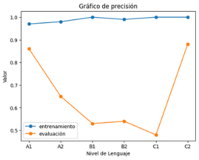

**Título:**

Adaptación de Textos para el Aprendizaje de Lenguas Castellanas.

**Resumen:**

En este proyecto buscamos: a partir de un texto en Castellano y un nivel de Aprendizaje del MCER (A1, A2, B1, B2, C1, C2), aplicar un modelo de lenguajes para transcribir el texto al nivel deseado sin perder su significado original.

**Hipótesis de trabajo:**

- Todo texto es categorizable en algún nivel de aprendizaje MCER (A1, A2, B1, B2, C1, C2).
- Es posible reescribir cualquier texto en distintos niveles sin modificar su significado original.

**Objetivos preliminares:**

1. Conseguir un Dataset con textos en Castellano etiquetados por nivel (A1, A2, B1, B2, C1, C2).
    - Intentamos conseguir un Dataset de estas características, pero no tuvimos éxito. La alternativa que encontramos fue utilizar un Dataset en Inglés (ya etiquetado) y traducirlo al Castellano.
    - Nota: La traducción podría generar ruido a la muestra. Se hará una estimación del ruido generado por la traducción.
2. Buscar Modelos de Lenguaje que puedan trabajar en la tarea de Adaptación de textos en Castellano.
   1. Optamos por dos opciones: Mistral y Cohere.
2. Obtener o entrenar un Clasificador de Texto para los niveles MCER en Castellano.
    - Realizamos un “balanceo de clases” en el dataset traducido al   castellano. Este subdataset está conformado por 1200 textos (200 textos de cada clase).
    - Se realizaron entrenamientos con BERT y linearSVC.
        - Los mejores resultados fueron obtenidos con BERT (accuracy: 66%) mientras que con LinearSVC (accuracy: 55%).
    - Notamos que las predicciones erróneas se acumulaban casi por completo en los niveles adyacentes (cuando se equivocaba era en un nivel próximo, no eran errores graves).
    - Para una mejor comprensión, utilizamos una métrica de interés: la Precisión Aproximada o Precisión Intuitiva. Donde las predicciones erróneas adyacentes valen como medio acierto (0.5)
4. Para cada Modelo de Lenguaje, comparar precisión y velocidad de Adaptación de textos.
    - Para compararlos, se usó una muestra del subdataset con clases balanceadas. Esta muestra estaba conformada por 120 textos (20 textos de cada clase).
    - Para realizar la comparación utilizamos el clasificador anteriormente entrenado.
    - Al ejecutar ambos modelos, Cohere mostró un notable desempeño por encima de Mistral.
        - Cohere: Demoró 15 mins, Precisión Exacta del 39% y Precisión Aproximada del 55%.
        - Mistral: Demoró 45 min, Precisión Exacta del 21% y Precisión Aproximada del 38%.
5. Fine-Tuning del Modelo de Lenguaje con mejor rendimiento.
    - Decidimos realizar Fine-Tuning con el modelo de mejor rendimiento (Cohere).
        - Afortunadamente, Cohere provee de una API donde podemos realizar fine-tuning proveyendo un dataset de entrenamiento (tipo chat). Esto nos ahorra la capacidad de cómputo.
        - Desafortunadamente, esta es la única forma de realizar fine-tuning con Cohere y sus capacidades son limitadas (a menos que pagues la subscripción). Sin embargo, esperamos que los resultados sean suficientemente satisfactorios.

**Referencias:**

- Modelos de Lenguajes:
    - [Mistral AI | Frontier AI in your hands](https://mistral.ai/)
    - [Cohere | The leading AI platform for enterprise](https://cohere.com/)
- Dataset en Inglés: [CEFR Levelled English Texts (kaggle.com)](https://www.kaggle.com/datasets/amontgomerie/cefr-levelled-english-texts)
- Traductor EN-ES: [Helsinki-NLP/opus-mt-en-es · Hugging Face](https://huggingface.co/Helsinki-NLP/opus-mt-en-es)
- Traducción (Código): [notebook9834025409 | Kaggle](https://www.kaggle.com/code/alexistomascenteno/notebook9834025409/edit/run/197471934)

**Planificación:**

- Semana 1: Septiembre 23 a 29.
  - Conseguir Dataset con textos en castellano etiquetados por nivel MCER (Objetivo 1).
- Semana 2: Septiembre 30 a Octubre 6
  - Traducción del Dataset con textos en inglés etiquetados por nivel al castellano (Objetivo 1).
  - Buscar Modelos de Lenguaje que puedan trabajar en la tarea de Adaptación de textos en Castellano (Objetivo 2).
- Semana 3: Septiembre 7 a 13.
  - Obtener o entrenar un Clasificador de Texto para los niveles MCER en Castellano (Objetivo 3).
- Semana 4: Septiembre 14 a 20.
  - Para cada Modelo de Lenguaje, comparar precisión y velocidad de Adaptación de textos. Decidir el mejor (Objetivo 4).
- Semana 5: Septiembre 21 a 27.
  - Fine-Tuning del Modelo de Lenguaje con mejor rendimiento (Objetivo 5).
- Semana 6: Septiembre 28 a Noviembre 3.
- Estimación del ruido generado por traducción (Incorporación de Feedbacks).
- Exploración del Fine-Tuning con fin de mejorar desempeño (Objetivo 5).
- Elaboración de informe: últimas pruebas y ajustes.

**Desarrollo del Proyecto:**

1. **Dataset:**

Para iniciar, necesitamos un conjunto de datos que contenga textos etiquetados según los niveles de aprendizaje del MCER, lo cual es esencial para el entrenamiento y la evaluación del modelo. Sin embargo, nos enfrentamos a un desafío significativo: la falta de datasets en español debidamente etiquetados. Por esto decidimos traducir un conjunto de datos etiquetado en inglés, específicamente [CEFR Levelled English Texts (kaggle.com)](https://www.kaggle.com/datasets/amontgomerie/cefr-levelled-english-texts) disponible en Kaggle.

|  |  |
|:------------------------------------------:|:-------------------------------------------:|
| Original                                   | Traducido                                   |

La traducción de un conjunto de datos presenta una desventaja significativa: algunos textos pueden quedar mal etiquetados durante el proceso de traducción. Esto puede introducir ruido en el entrenamiento y, dado que no contamos con un clasificador de texto en español que pueda corregir estos errores, el uso de este dataset podría ser contraproducente.


Más adelante mostraremos el ruido generado por la traducción.

Antes de trabajar con el dataset traducido, realizamos un "balanceo de clases", tomando como referencia la clase minoritaria (C2 = 200).


Esto se hace para evitar que el modelo desarrolle sesgos hacia clases mayoritarias, lo que podría llevar a que ignore patrones importantes de las clases minoritarias.

2. **Clasificador:**

Antes de iniciar las pruebas con modelos de lenguaje, es fundamental contar con un clasificador de texto que nos permita realizar comparaciones de precisión. Como mencionamos anteriormente, no encontramos un clasificador específico para textos en español que utilice niveles del MCER. Por lo tanto, decidimos entrenar un clasificador utilizando un conjunto de datos ya etiquetado. Para ello, exploramos diferentes enfoques de entrenamiento:

- BERT
- FeedForward
- LinearSVC

Los mejores resultados se obtuvieron entrenando con BERT, siguiendo la [Guía de entrenamiento](https://youtu.be/8yrD0hR8OY8?si=YWhzLPNBcfRtAq2Y) y utilizando **AutoModelForSequenceClassification** con los siguientes parámetros:

- 75% de los datos destinados para entrenamiento y 25% para pruebas.
- 12 épocas.
- Batch size = 32. 

A continuación, se presentan las precisiones del clasificador, tanto para los datos de entrenamiento como para los de prueba:

### Predicciones con dataset de entrenamiento

| Clase | Precisión | Recall | F1-Score | Soporte |
|-------|-----------|--------|----------|---------|
| 0     | 0.97      | 0.99   | 0.98     | 147      |
| 1     | 0.98      | 0.97   | 0.97     | 151      |
| 2     | 1.00      | 0.99   | 1.00     | 156      |
| 3     | 0.99      | 1.00   | 0.99     | 151      |
| 4     | 1.00      | 0.98   | 0.99     | 151      |
| 5     | 1.00      | 1.00   | 1.00     | 144      |
| **Precisión global** | |        | **0.99**  | **900** |
| **Promedio macro**  | 0.99      | 0.99   | 0.65     | 900      |
| **Promedio ponderado** | 0.99 | 0.99 | 0.65       | 900      |

### Predicciones con dataset de evaluación

| Clase | Precisión | Recall | F1-Score | Soporte |
|-------|-----------|--------|----------|---------|
| 0     | 0.86      | 0.72   | 0.78     | 53      |
| 1     | 0.65      | 0.71   | 0.68     | 49      |
| 2     | 0.53      | 0.48   | 0.50     | 44      |
| 3     | 0.54      | 0.65   | 0.59     | 49      |
| 4     | 0.48      | 0.69   | 0.57     | 49      |
| 5     | 0.88      | 0.50   | 0.64     | 56      |
| **Precisión global** | |        | **0.63**  | **300** |
| **Promedio macro**  | 0.66      | 0.63   | 0.63     | 300      |
| **Promedio ponderado** | 0.67 | 0.63 | 0.63       | 300      |

**Datos de entrenamiento Datos de testeo**

Si graficamos las precisiones en función de las diferentes clases, podremos identificar más claramente cuáles son las clases problemáticas. El clasificador tuvo mayores dificultades para distinguir los casos intermedios, en particular los de la clase C1.



Esta problemática se evidencia aún más en la matriz de confusión.


A pesar de esto, podemos observar que los resultados son bastante cercanos y que las predicciones erróneas se concentran principalmente en los niveles adyacentes. Este pequeño desfase es algo que incluso pueden experimentar los profesionales. Por lo tanto, la precisión del 66% se refiere únicamente a las predicciones exactas.

Para una mejor comprensión, utilizaremos una métrica de interés: Precisión Aproximada. Al clasificar un texto, se tomará una corrección de desfase, definida como: correcion = | nivel_esperado − nivel_predecido |

- Si la corrección es 0, consideraremos que la predicción es correcta (y la contaremos como 1).
- Si la corrección es 1, consideraremos que la predicción es más o menos correcta (y la contaremos como 0.5).
- En cualquier otro caso, la predicción se considerará incorrecta (y la contaremos como 0).

Si bien la **precisión exacta** es del **66%**, al analizar nuestra métrica de interés, podemos afirmar que el clasificador tiene una **Precisión Intuitiva** o **Precisión Aproximada** del **96%.**

Con estos datos, podemos proceder a analizar el **ruido generado por la traducción**. Para ello, desarrollaremos un clasificador en inglés que utilice los mismos parámetros de entrenamiento que el clasificador en español, empleando el conjunto de datos original, pero equilibrado de la misma manera que el conjunto traducido.

A continuación, se presentan las precisiones del clasificador, tanto para los datos de entrenamiento como para los de prueba:

### Predicciones con dataset de entrenamiento

| Clase | Precisión | Recall | F1-Score | Soporte |
|-------|-----------|--------|----------|---------|
| 0     | 1.00      | 1.00   | 1.00     | 140      |
| 1     | 1.00      | 1.00   | 1.00     | 152      |
| 2     | 1.00      | 1.00   | 1.00     | 141      |
| 3     | 1.00      | 1.00   | 1.00     | 146      |
| 4     | 1.00      | 1.00   | 1.00     | 163      |
| 5     | 1.00      | 1.00   | 1.00     | 158      |
| **Precisión global** | |        | **1.00**  | **900** |
| **Promedio macro**  | 1.00      | 1.00   | 1.00     | 900      |
| **Promedio ponderado** | 1.00 | 1.00 | 1.00       | 900      |

### Predicciones con dataset de evaluación

| Clase | Precisión | Recall | F1-Score | Soporte |
|-------|-----------|--------|----------|---------|
| 0     | 0.86      | 0.80   | 0.83     | 60      |
| 1     | 0.67      | 0.77   | 0.72     | 48      |
| 2     | 0.61      | 0.46   | 0.52     | 59      |
| 3     | 0.51      | 0.54   | 0.52     | 54      |
| 4     | 0.46      | 0.68   | 0.55     | 37      |
| 5     | 0.82      | 0.67   | 0.74     | 42      |
| **Precisión global** | |        | **0.65**  | **300** |
| **Promedio macro**  | 0.66      | 0.65   | 0.65     | 300      |
| **Promedio ponderado** | 0.66 | 0.65 | 0.65       | 300      |

Como se puede observar, el clasificador en inglés enfrenta dificultades similares a las del clasificador en español. Es importante examinar la matriz de confusión.


La similitud entre la matriz de confusión del clasificador en inglés y la del español es evidente. Por lo tanto, podemos inferir que la traducción genera un ruido casi imperceptible.

3. **Modelos de lenguaje:**

En este punto, procederemos a probar dos modelos que han demostrado ser fáciles de usar y efectivos para generar respuestas mediante un prompt:

- Mistral
- Cohere

Tomaremos una muestra de 120 textos y transformaremos cada uno a un nivel aleatorio. Para ambos modelos, utilizaremos el siguiente prompt:

```python
prompt = lambda label, text:  f"""

A continuación, te proporcionaré un texto en español y te pediré que lo modifiques para diferentes niveles de competencia lingüística
(A1, A2, B1, B2, C1 y C2), concretamente: {label}. El objetivo es que adaptes el texto según el nivel de dificultad, modificando el
vocabulario y las estructuras gramaticales para que se ajusten a cada nivel, pero manteniendo el mismo mensaje central. Solo responde
con la version del texto modificada para dicho nivel. No incluyas ninguna introducción, título, explicación o comentario. Solamente dame
el texto adaptado.

Aquí está el texto:
{text}
"""
```

Donde **label** representa el nivel deseado para generar el texto, y **text** es el texto que servirá como base para la generación. Con esto, podemos proceder a realizar las pruebas y comparaciones.

Con el prompt definido, empezaremos probando Mistral.

La primera impresión obtenida es el tiempo de ejecución, el cual fue de **47 minutos**. En dicha ejecución obtuvimos los siguientes resultados:

```
Procentaje de precisión (Exacto): 0.20833333333333334
Procentaje de precisión (Aproximado): 0.37916666666666665
```

Como se puede observar, las predicciones (considerando la corrección mencionada al final de la sección anterior) son bastante deficientes, con un rendimiento por debajo de 0.5. Esta situación se ilustrará de manera más clara en la matriz de confusión.


Ahora probemos con Cohere. Este modelo impresionantemente logró ejecutar lo mismo que Mistral pero en **16 min**, obteniendo los siguiente resultados:

```
Procentaje de precisión (Exacto): 0.39166666666666666
Procentaje de precisión (Aproximado): 0.55
```

Es evidente que estos resultados superan a los obtenidos por Mistral. Esto se puede apreciar con mayor claridad al observar la matriz de confusión de Cohere.


Se puede observar la dificultad para diferenciar los casos intermedios, especialmente en las clases B1 y B2, así como en el caso de C2. Aun así, es evidente que Cohere ha logrado interpretar el prompt de manera más efectiva que Mistral, generando textos de mejor calidad.

Considerando el tiempo de ejecución y los resultados obtenidos, **Cohere** se presenta como la mejor opción.

4. **Fine-tuning del modelo:**

Tomamos una muestra aleatoria de 1200 textos del Dataset y le pedimos a Cohere adaptarlos a distintos niveles. Usamos la misma proporción para cada nivel (es decir, 200 de cada nivel). Luego a esos **Textos Adaptados** los revisamos con el Clasificador de Texto para que nos diga su nivel real.

Observaciones: Vemos que Cohere tiene dificultades para adaptar textos a niveles más altos.

**Todos (Sin filtro):**

```
Porcentaje de precisión (Exacto):  0.31
Porcentaje de precisión (Aproximado):  0.522083333333333333
Cantidad de Textos:  1200
```

| Label | Precisión |
|-------|-----------|
| A1    | 208       |
| A2    | 293       |
| B1    | 193       |
| B2    | 208       |
| C1    | 199       |
| C2    | 99        |

**Solo exactos (Adaptaciones Exactas)**

```
Porcentaje de precisión (Exacto):  1.0
Porcentaje de precisión (Aproximado):  1.0
Cantidad de Textos:  372
```

| Label | Precisión |
|-------|-----------|
| A1    | 116       |
| A2    | 85        |
| B1    | 41        |
| B2    | 50        |
| C1    | 45        |
| C2    | 35        |

**Exactos y Adyacentes**

```
Porcentaje de precisión (Exacto):  0.42224744608399545
Porcentaje de precisión (Aproximado):  0.7111237230419978
Cantidad de Textos:  881
```

| Label | Precisión |
|-------|-----------|
| A1    | 166       |
| A2    | 214       |
| B1    | 116       |
| B2    | 144       |
| C1    | 172       |
| C2    | 69        |

**Exactos + mitad de textos Adyacentes**

```
Porcentaje de precisión (Exacto):  0.5933014354066986
Porcentaje de precisión (Aproximado):  0.79665071177033493
Cantidad de Textos:  627
```

| Label | Precisión |
|-------|-----------|
| A1    | 142       |
| A2    | 149       |
| B1    | 80        |
| B2    | 94        |
| C1    | 109       |
| C2    | 53        |


Al hacer Fine-Tuning con las 4 muestras obtuvimos los siguientes resultados: 

### Exacto (372 textos)

```
Porcentaje de precisión (Exacto):  0.18333333333333332
Porcentaje de precisión (Aproximado):  0.27083333333333335
```

### Exacto\_adyacentes (627 textos):

```
Porcentaje de precisión (Exacto):  0.18333333333333332
Porcentaje de precisión (Aproximado): 0.358333333333333334
```

### Exacto\_mitadadyacentes (881 textos):

```
Porcentaje de precisión (Exacto):  0.19166666666666668
Porcentaje de precisión (Aproximado):  0.39166666666666666
```

### Completo\_sinfiltro (1200 textos)

```
Porcentaje de precisión (Exacto):  0.175
Porcentaje de precisión (Aproximado):  0.36666666666666664
```

De todos los anteriores, el más prometedor es entrenar únicamente con aquellas adaptaciones de texto que el Clasificador considera exactas (Dataset Exactos). A pesar de ser la muestra más pequeña, tuvo resultados similares al resto (Exacto\_mitadadyacentes fue ligeramente superior pero tenía casi el triple de textos).

El problema consiste en el tamaño de la muestra: es necesario hacer una enorme cantidad de llamadas para luego filtrarlas y quedarnos con aquellas que el Clasificador considera exactas.

El tamaño del dataset de entrenamiento se vio limitado ya que Cohere limita la cantidad de llamadas a la Api (1000 llamadas por mes). Además Cohere limita los parámetros que se pueden utilizar para realizar fine-tuning en su manera gratuita.

Desafortunadamente, los resultados después del fine-tuning son incluso peores que los originales. Si tuviéramos más llamadas a la Api podríamos generar más textos y filtrar los exactos, para que sea una muestra mayor y por lo tanto un mejor resultado de entrenamiento.

**Conclusiones:**

No pudimos entrenar satisfactoriamente un adaptador de textos en castellano a los distintos niveles de aprendizaje del MCER.

Logramos entrenar satisfactoriamente un Clasificador de textos a distintos niveles de aprendizaje del MCER. Si hubiera más tiempo y más recursos se podrían seguir introduciendo prompts y filtrar aquellos que sean mejores según el clasificador y con eso seguir entrenando hasta que se puedan adaptar satisfactoriamente. El verdadero problema fue la limitación que Cohere impone a los usuarios gratuitos, desafortunadamente no tuvimos en cuenta este detalle.

**Aspectos que pueden mejorar:**

- Elaboración de un Dataset original en Castellano con niveles etiquetados sin recurrir a traducción. 
- Elección de un mejor Modelo de Lenguaje base que sea gratuito o alternativamente pagar para no tener limitaciones en consultas de Api ni entrenamiento de Fine-Tuning.
