**Título:**

Adaptación de Textos para el Aprendizaje de Lenguas Castellanas.

**Resumen:**

En este proyecto buscamos: a partir de un texto en Castellano y un nivel de Aprendizaje del MCER (A1, A2, B1, B2, C1, C2), aplicar un modelo de lenguajes para transcribir el texto al nivel deseado sin perder su significado original.

**Hipótesis de trabajo:**

- Todo texto es categorizable en algún nivel de aprendizaje MCER (A1, A2, B1, B2, C1, C2).
- Es posible reescribir cualquier texto en distintos niveles sin modificar su significado original.
1. **Dataset:**

Para iniciar, necesitamos un conjunto de datos que contenga textos etiquetados según los niveles de aprendizaje del MCER, lo cual es esencial para el entrenamiento y la evaluación del modelo. Sin embargo, nos enfrentamos a un desafío significativo: la falta de datasets en español debidamente etiquetados. Debido a esto, decidimos traducir un conjunto de datos etiquetado en inglés, específicamente los [CEFR Levelled English Texts (kaggle.com)](https://www.kaggle.com/datasets/amontgomerie/cefr-levelled-english-texts) disponibles en Kaggle.

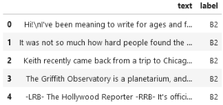 

Original Traducido

La traducción de un conjunto de datos presenta una desventaja significativa: algunos textos pueden quedar mal etiquetados durante el proceso de traducción. Esto puede introducir ruido en el entrenamiento y, dado que no contamos con un clasificador de texto en español que pueda corregir estos errores, el uso de este dataset podría ser contraproducente. A pesar de esto, decidimos seguir este enfoque debido a la facilidad para acceder a un conjunto de datos etiquetado con una amplia cantidad de ejemplos.

Antes de trabajar con el dataset traducido, realizamos un "balanceo de clases", tomando como referencia la clase minoritaria (C2 = 200).

Esto se hace para evitar que el modelo desarrolle un sesgo hacia la clase mayoritaria, lo que podría llevar a que ignore patrones importantes de la clase minoritaria.

2. **Clasificador:**

Antes de iniciar las pruebas con modelos de lenguaje, es fundamental contar con un clasificador de texto que nos permita realizar comparaciones de precisión. Como mencionamos anteriormente, no encontramos un clasificador específico para textos en español que utilice niveles del MCER. Por lo tanto, decidimos entrenar un clasificador utilizando un conjunto de datos ya etiquetado. Para ello, exploramos diferentes enfoques de entrenamiento:

- BERT
- FeedForward
- LinearSVC

Los mejores resultados se lograron al entrenar con BERT, siguiendo la [Guía de entrenamiento](https://youtu.be/8yrD0hR8OY8?si=YWhzLPNBcfRtAq2Y) y utilizando **AutoModelForSequenceClassification** con los siguientes parámetros:

- 75% del conjunto de datos para entrenamiento y 25% para pruebas.
- 12 épocas.
- Batch size = 32.

A continuación, se presentan las precisiones del clasificador, tanto para los datos de entrenamiento como para los de prueba: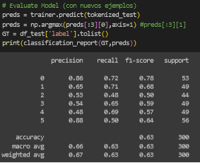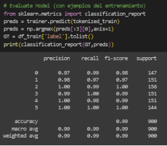

**Datos de entrenamiento Datos de testeo**

Si graficamos las precisiones en función de las diferentes clases, podremos identificar más claramente cuáles son las clases problemáticas.

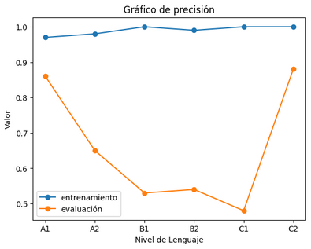

Como se puede observar, el clasificador tuvo mayores dificultades para distinguir los casos intermedios, en particular los de la clase C1. Esta problemática se evidencia aún más en la matriz de confusión.

A pesar de esto, podemos observar que los resultados son bastante cercanos, aunque un poco difuminados, y que las predicciones erróneas se concentran principalmente en los niveles adyacentes. Este pequeño desfase es algo que incluso pueden experimentar los profesionales. Por lo tanto, la precisión del 66% se refiere únicamente a las predicciones exactas.

Para una mejor comprensión, utilizaremos una métrica de interés: la Precisión Aproximada. Al clasificar un texto, se realizará una corrección de desfase, definida como ó = | \_ − \_ |.

- Si la corrección es 0, consideraremos que la predicción es correcta (y la contaremos como 1).
- Si la corrección es 1, consideraremos que la predicción es más o menos correcta (y la contaremos como 0.5).
- En cualquier otro caso, la predicción se considerará incorrecta (y la contaremos como 0).

Si bien la **precisión exacta** es del **66%**, al analizar nuestra métrica de interés, podemos afirmar que el clasificador tiene una **Precisión Intuitiva** o **Precisión Aproximada** del **96%.**

Con estos datos, podemos proceder a analizar el ruido generado por la traducción. Para ello, desarrollaremos un clasificador en inglés que utilice los mismos parámetros de entrenamiento que el clasificador en español, empleando el conjunto de datos original, pero equilibrado de la misma manera que el conjunto traducido.

A continuación, se presentan las precisiones del clasificador, tanto para los datos de entrenamiento como para los de prueba:

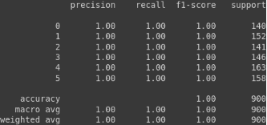 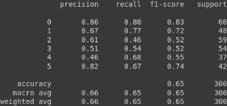

**Datos de entrenamiento Datos de testeo**

Como se puede observar, el clasificador en inglés enfrenta dificultades similares a las del clasificador en español. Es importante examinar la matriz de confusión.

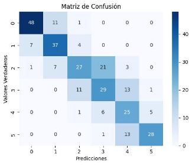

La similitud entre la matriz de confusión del clasificador en inglés y la del español es evidente. Por lo tanto, podemos inferir que la traducción genera un ruido casi imperceptible.

3. **Modelos de lenguaje:**

En este punto, procederemos a probar dos modelos que han demostrado ser fáciles de usar y efectivos para generar respuestas mediante un prompt:

- Mistral
- Cohere

Tomaremos una muestra de 120 textos y transformaremos cada uno a un nivel aleatorio. Para ambos modelos, utilizaremos el siguiente prompt:

Donde **label** representa el nivel deseado para generar el texto, y **text** es el texto que servirá como base para la generación. Con esto, podemos proceder a realizar las pruebas y comparaciones.

Con el prompt definido, empezaremos probando Mistral.

La primera impresión obtenida es el tiempo de ejecución, el cual fue de 47 minutos. En dicha ejecución obtuvimos los siguientes resultados:

Como se puede observar, las predicciones (considerando la corrección mencionada al final de la sección anterior) son bastante deficientes, con un rendimiento por debajo de 0.5. Esta situación se ilustrará de manera más clara en la matriz de confusión.

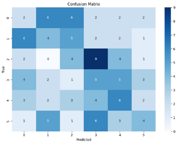

Ahora probemos con Cohere. Este modelo impresionantemente logró ejecutar lo mismo que Mistral pero en **16 min**, obteniendo los siguiente resultados:

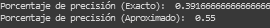

Es evidente que estos resultados superan a los obtenidos por Mistral. Esto se puede apreciar con mayor claridad al observar la matriz de confusión de Cohere.

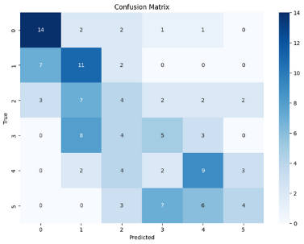

Se puede observar la dificultad para diferenciar los casos intermedios, especialmente en las clases B1 y B2, así como en el caso de C2. Aun así, es evidente que Cohere ha logrado interpretar el prompt de manera más efectiva que Mistral, generando textos de mejor calidad.

Considerando el tiempo de ejecución y los resultados obtenidos, Cohere se presenta como la mejor opción.

4. **Fine-tuning del modelo:**

Tomamos una muestra aleatoria de 1200 textos del Dataset y le pedimos a Cohere adaptarlos a distintos niveles. Usamos la misma proporción para cada nivel (es decir, 200 de cada nivel). Luego a esos **Textos Adaptados** los revisamos con el Clasificador de Texto para que nos diga su nivel real.

Observaciones: Vemos que Cohere tiene dificultades para adaptar textos a niveles más altos.

**Todos (Sin filtro)**

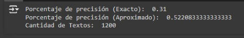 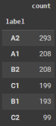

200 de cada uno = Nivel real

Nivel real de textos adaptados

**Solo exactos (Adaptaciones Exactas)**

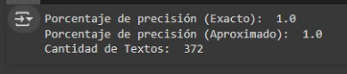 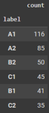

**Exactos y Adyacentes**

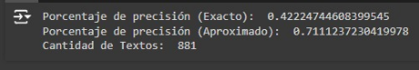 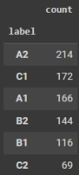

**Exactos + mitad de textos Adyacentes**

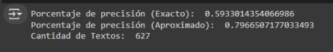 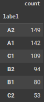

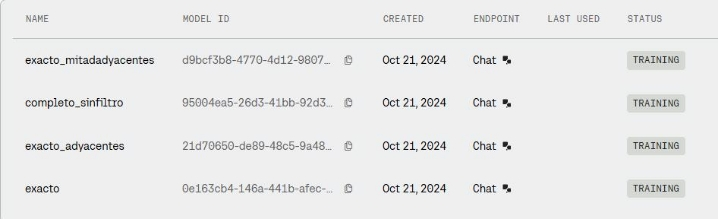

Al hacer Fine-Tuning con las 4 muestras obtuvimos los siguientes resultados: Exacto\_adyacentes:

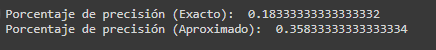

Exacto\_mitadadyacentes:

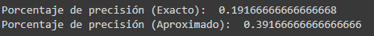

completo\_sinfiltro

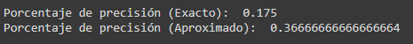

**Algo está mal con el Fine-Tuning?**
