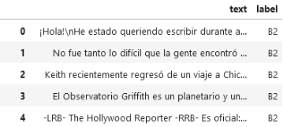
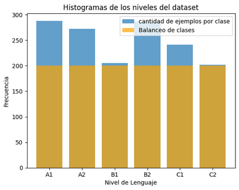
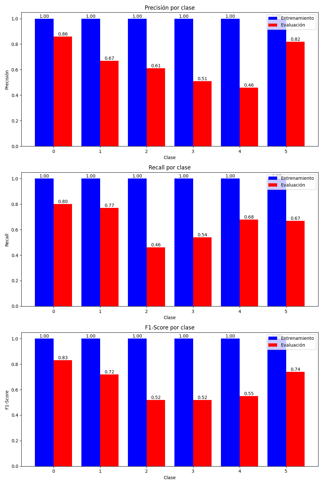
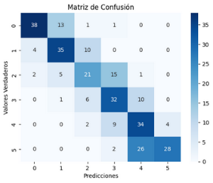
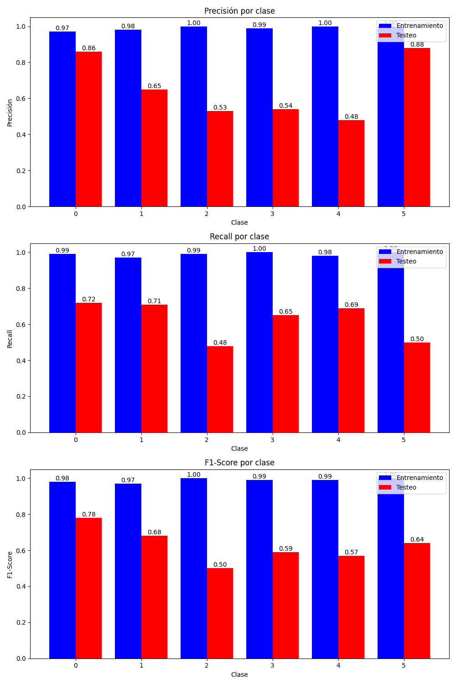
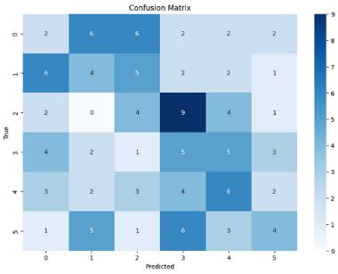
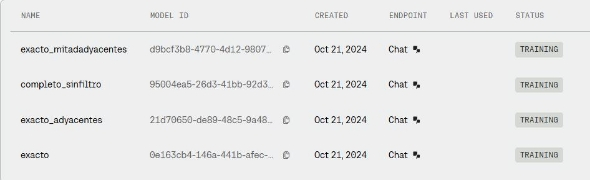

# Adaptación de Textos para el Aprendizaje del Español 📚

## Introducción ✍️

Este proyecto tiene como objetivo desarrollar un modelo de lenguaje, el cual tenga la capacidad de adaptar textos castellanos a los distintos niveles de complejidad establecidos por el MCER o "Marco Común Europeo de Referencia para las Lenguas". (Niveles del MCER: A1, A2, B1, B2, C1, C2). Para la adaptación de los textos, estos deben ajustarse apropiadamente a la complejidad lingüística solicitada y conservar su significado original.

## Hipótesis de Trabajo 🤔

Antes de iniciar el desarrollo del proyecto, planteamos las siguientes hipótesis:
- Todo texto puede clasificarse dentro de un nivel de competencia lingüística según el MCER.
- Es posible reescribir un texto en distintos niveles manteniendo su significado esencial.

## Objetivos Preliminares 🎯

El desarrollo del proyecto se basa en los siguientes objetivos:
1. Obtener un conjunto de datos con textos en español etiquetados por nivel de competencia lingüística (A1, A2, B1, B2, C1, C2).
2. Desarrollar y entrenar un clasificador de texto que identifique el nivel MCER en español, permitiendo la comparación con modelos generadores de texto.
3. Evaluar modelos de lenguaje para la adaptación de textos en español:
    - Comparar la precisión y velocidad de adaptación de cada modelo.
    - Seleccionar el modelo con mejor rendimiento.
4. Realizar un ajuste fino (*fine-tuning*) del modelo de lenguaje seleccionado para mejorar su desempeño en la tarea de adaptación de textos.

## Desarrollo del Proyecto 🔧

### 1. Dataset 📂

El primer paso fue obtener un conjunto de datos con textos etiquetados según los niveles del MCER. No encontramos un dataset adecuado en español, por lo que optamos por traducir el dataset **[CEFR Levelled English Texts (Kaggle)](https://www.kaggle.com/datasets/amontgomerie/cefr-levelled-english-texts)** del inglés al español.

|  |  |
|:--------------------------------:|:--------------------------------:|
| Texto original en inglés         | Texto traducido al español      |

La traducción puede introducir errores en las etiquetas, generando **ruido** en los datos. A pesar de ello, utilizamos este dataset traducido con la expectativa de que sea lo suficientemente preciso como para entrenar un buen modelo.

Para minimizar sesgos, realizamos un **balanceo de clases**, tomando como referencia la clase minoritaria (C2 = 200).



Este balanceo ayuda a evitar que el modelo favorezca las clases mayoritarias e ignore patrones importantes en las minoritarias.


### 2. Clasificador 🔍

Antes de evaluar los modelos de lenguaje, es necesario contar con un **clasificador de texto** que permita comparar la precisión de los resultados. Sin embargo, no pudimos encontrar un clasificador de textos el cual fuera específico para niveles del MCER en castellano. Por este motivo es que decidimos entrenar uno propio, utilizando nuestro dataset previamente etiquetado.

#### Enfoques de Entrenamiento 🔬

Probamos tres enfoques distintos para entrenar el clasificador:

- **BERT** 🤖
- **Red Neuronal FeedForward** 🧠
- **LinearSVC** ⚙️

##### **1. BERT** 🤖
BERT es un modelo basado en *transformers* que comprende el contexto de las palabras dentro de una oración. Utilizamos DistilBERT, una versión ligera de BERT, para clasificar los textos según su nivel MCER. El proceso incluyó:

- Tokenización de los textos con un *tokenizer* preentrenado.
- Conversión del dataset a un formato compatible con Hugging Face.
- Ajuste fino (*fine-tuning*) del modelo para la clasificación de secuencias.
- Entrenamiento con *cross-entropy loss* y evaluación con *accuracy*.

##### **2. Red Neuronal FeedForward** 🧠
Este enfoque implementa una red neuronal densa para la clasificación de textos. Sus principales componentes incluyen:

- **Capa de entrada**: recibe representaciones vectoriales de los textos.
- **Capas ocultas**: utilizan activaciones ReLU para capturar patrones no lineales.
- **Capa de salida**: una función *softmax* que asigna probabilidades a cada nivel MCER.

El modelo se entrenó mediante *backpropagation*, optimización con Adam y *cross-entropy loss* categórica. Sin embargo, este enfoque requiere cierto conocimiento en diseño de redes neuronales, algo que nosotros no tenemos y los resultados (como consecuencia) fueron deficientes, con un 37% de precisión en el mejor de los casos.

##### **3. LinearSVC** ⚙️
Este enfoque emplea un clasificador de *Máquinas de Soporte Vectorial* (SVM) con los siguientes pasos:

- Vectorización TF-IDF para convertir los textos en representaciones numéricas.
- Entrenamiento de un modelo LinearSVC para encontrar un hiperplano que separe los textos por nivel MCER.
- Evaluación con métricas de clasificación, incluyendo *accuracy* y *recall*.

Si bien LinearSVC fue sencillo de implementar y ejecutar, sus resultados fueron similares a los obtenidos con la red neuronal FeedForward.

##### **Resultados y Elección del Modelo**

Luego de realizar los respectivos entrenamientos, obtuvimos el mejor rendimiento con BERT. No presentaremos todos los resultados de los clasificadores, ya que el análisis de clasificadores de texto no forma parte del objetivo de este proyecto, pero sí mencionaremos los parámetros de entrenamiento que dieron los mejores resultados con BERT, en caso de que se desee replicar este clasificador:

- 75% de los datos para entrenamiento y 25% para pruebas.
- 12 épocas ⏳.
- **Batch size** = 32.

Aplicados de la siguiente forma:

```python
training_args = TrainingArguments(
    output_dir="./results",
    learning_rate=5e-5,
    per_device_train_batch_size=8,
    per_device_eval_batch_size=8,
    num_train_epochs=12,
    weight_decay=0.1,
    eval_strategy="epoch",
    logging_strategy="epoch"
)

trainer = Trainer(
    model=model,
    args=training_args,
    train_dataset=tokenized_train,
    eval_dataset=tokenized_test,
    tokenizer=tokenizer,
    data_collator=data_collator,
    compute_metrics=compute_metrics
)

trainer.train()
```

### Precisión del Clasificador con el Enfoque BERT 📊



Al graficar la precisión de cada clase, se observa que nuestro clasificador enfrenta mayores dificultades en los niveles intermedios, especialmente en la clase **C1**.

Esta problemática se refleja con mayor claridad en la siguiente **matriz de confusión**:



A pesar de esto, es importante notar que la mayoría de estos errores se producen en niveles muy cercanos (principalmente aquellos niveles que son adyacentes), esto implicaría que el desfase es en realidad leve (este tipo de imprecisiones es algo que pueden experimentar incluso los profesionales del área). Por lo tanto, la **precisión del 66%** corresponde exclusivamente a aquellas predicciones que llamaremos **predicciones exactas**.

### Precisión Aproximada 📈

Para una mejor evaluación del desempeño de nuestro clasificador, introduciremos una métrica de interés llamada **Precisión Aproximada**. Esta métrica utiliza el siguiente criterio:

- **Corrección = | nivel_esperado − nivel_predecido |**
- Si la corrección es **0**, la predicción es **correcta** (1 punto). ✅
- Si la corrección es **1**, la predicción es **aproximadamente correcta** o **adyacente** (0.5 puntos). 🤔
- En cualquier otro caso, la predicción es **incorrecta** (0 puntos). ❌

Es decir, si bien la **Precisión Exacta** sigue siendo del **66%**, podemos tomar en consideración también la  **Precisión Aproximada**, la cual alcanza un **96%** de precisión. 🎯

Si bien estos resultados son alentadores, es importante considerar que la traducción del conjunto de datos introduce cierto nivel de ruido en el entrenamiento, lo que puede afectar la precisión del clasificador.

#### Ejemplo de uso de Clasificador en español

Luego de realizar el entrenamiento, guradamos el modelo de la siguiente forma:

```python
trainer.save_model('path of the classifier folder')
tokenizer.save_pretrained('path of the classifier folder')
```

Cargamos y usamos el modelo de una manera similar:

```python
from transformers import AutoTokenizer, AutoModelForSequenceClassification

model_path = "path of the classifier folder"

tokenizer = AutoTokenizer.from_pretrained(model_path)
model = AutoModelForSequenceClassification.from_pretrained(model_path)
```

Ahora necesitamos seleccionar un texto. Supongamos que queremos clasificar el siguiente texto obtenido del dataset de la anterior seccion (un texto de nivel A1):

```
Esto es divertido, papá.
Sí, lo es. Vamos a pescar.
¿Qué debo hacer?
Sostenga su poste sobre el agua.
¿Así?
Sí. ¡Mira! Cogiste un pez.
¡Papá! ¿Qué hago?
Espera, hijo. Conseguiré una red.
```

Para ello, hacemos lo siguiente:

```python
import torch

# Dataset pat: 0. Dataset/spanish_dataset200.csv
text = df["text"][198] 

# Tokenización del texto
inputs = tokenizer(text, return_tensors="pt", truncation=True, padding=True)

# Inferencia del modelo
with torch.no_grad():
    outputs = model(**inputs)

# Obtención de los logits
logits = outputs.logits

# Convertir logits en probabilidades usando softmax
probabilities = torch.nn.functional.softmax(logits, dim=-1)

# Obtener el índice de la clase con la mayor probabilidad
predicted_class = torch.argmax(probabilities, dim=-1).item()
levels = ["A1", "A2", "B1", "B2", "C1", "C2"]
predicted_level = levels[predicted_class]

print(predicted_level)
```

Y con esto obtenemos como salida el label predicho (En este caso: **A1**).


### Comparación con Clasificador en Inglés 🌍

Para evaluar el impacto del **ruido de traducción**, entrenamos un clasificador en inglés utilizando los mismos parámetros y un conjunto de datos balanceado.

 

Como se puede observar, el clasificador en inglés enfrenta dificultades similares a las del clasificador en español. Para comprender mejor estos resultados, es fundamental analizar la **matriz de confusión**:  

  

La similitud entre las **matrices de confusión** de ambos clasificadores sugiere que el impacto de la traducción en el modelo es mínimo y no introduce un ruido significativo. Recordemos que cualquier posible ruido en los datos proviene del modelo de traducción utilizado.  

Sin embargo, es importante tener en cuenta que el propio clasificador también contribuye con su **error de entrenamiento**, lo que puede afectar la precisión general del sistema.  


### 3. Modelos de lenguaje para generación de texto 🌐

Probamos varios modelos, pero la mayoría resultó ser demasiado pesada, lenta o simplemente no interpretaba bien el prompt. Afortunadamente, encontramos dos modelos que destacaron por su facilidad de uso, rapidez, buena documentación y capacidad para comprender la tarea asignada:

- **Mistral** 🤖
- **Cohere** 🌐

Ambos funcionan mediante API, lo que significa que el procesamiento (incluyendo las peticiones por medio de un prompt, el fine-tuning, entre otros) se realiza en los servidores de sus desarrolladores y no en nuestras computadoras.

Para ambos modelos, utilizamos el siguiente prompt:

```python
prompt = lambda label, text: f"""
A continuación, te proporcionaré un texto en español y te pediré que lo modifiques para diferentes niveles de competencia lingüística
(A1, A2, B1, B2, C1 y C2), concretamente: {label}. El objetivo es que adaptes el texto según el nivel de dificultad, modificando el
vocabulario y las estructuras gramaticales para que se ajusten a cada nivel, pero manteniendo el mismo mensaje central. Solo responde
con la versión del texto modificada para dicho nivel. No incluyas ninguna introducción, título, explicación o comentario. Solamente dame
el texto adaptado.

Aquí está el texto:
{text}
"""
```

En este caso, **label** representa el nivel lingüístico deseado para la modificación del texto, y **text** es el texto base que se adaptará.

#### Ejemplo de uso de Mistral 🤖
A continuación, mostramos un ejemplo de cómo usamos Mistral con nuestro prompt

```python
from mistralai import Mistral

mistral_cli = Mistral(api_key="API_KEY_MISTRAL")

def run_mistral(user_message, model="mistral-large-latest"):
    messages = [
        {"role": "user", "content": user_message}
    ]
    chat_response = mistral_cli.chat.complete(
        model=model,
        messages=messages
    )
    return chat_response.choices[0].message.content
```

Siendo **user_message** el prompt con el texto y el nivel elegidos.

Ahora, dado el siguiente texto en nivel A1:

```
Jenna estaba en el aeropuerto. Estaba esperando su avión. Su avión partiría a las 19:00 horas. Eran solo las dos de la tarde. Ella tuvo tiempo de comer. Tuvo tiempo para estudiar. Fue al restaurante del aeropuerto. El restaurante estaba en el tercer piso. El restaurante estaba lleno. No había asientos vacíos. No había mesas vacías. Ella no quería estar en la fila. No quería esperar. Había otro restaurante en el aeropuerto. Estaba en el primer piso. Bajó al primer piso. Ese restaurante estaba casi vacío. Había muchos asientos y muchas mesas.
```

Le pediremos a Mistral que adapte este texto a A2 de la siguiente forma:

```
A continuación, te proporcionaré un texto en español y te pediré que lo modifiques para diferentes niveles de competencia lingüística (A1, A2, B1, B2, C1 y C2), concretamente: B2. El objetivo es que adaptes el texto según el nivel de dificultad, modificando el vocabulario y las estructuras gramaticales para que se ajusten a cada nivel, pero manteniendo el mismo mensaje central. Solo responde con la version del texto modificada para dicho nivel. No incluyas ninguna introducción, título, explicación o comentario. Solamente dame el texto adaptado.

Aquí está el texto:
Jenna estaba en el aeropuerto. Estaba esperando su avión. Su avión partiría a las 19.00 horas. Eran sólo las dos de la tarde. Ella tuvo tiempo de comer. Tuvo tiempo para estudiar. Fue al restaurante del aeropuerto. El restaurante estaba en el tercer piso. El restaurante estaba lleno. No había asientos vacíos. No había mesas vacías. Ella no quería estar en la fila. No quería esperar. Había otro restaurante en el aeropuerto. Estaba en el primer piso. Bajó al primer piso. Ese restaurante estaba casi vacío. Había muchos asientos y muchas mesas.
```

El resultado obtenido es:

```
Jenna estaba en el aeropuerto esperando su avión, que saldría a las 19:00 horas. Eran solo las dos de la tarde, así que decidió comer algo y estudiar un poco. Se dirigió al restaurante del tercer piso, pero estaba lleno y no había asientos disponibles. Como no quería hacer cola ni esperar, bajó al primer piso, donde encontró otro restaurante casi vacío con muchos asientos y mesas libres.
```

#### Ejemplo de uso de Cohere 🌐
A continuación, mostramos un ejemplo de cómo usamos Cohere con nuestro prompt

```python
import cohere

def run_cohere(user_message, model="command"):
    co = cohere.Client("API_KEY_COHERE")
    response = co.chat(message=user_message)
    return response.text
```

Siendo **user_message** el prompt con el texto y el nivel elegidos.

Dado el siguiente texto en nivel A1:

```
Jenna estaba en el aeropuerto. Estaba esperando su avión. Su avión partiría a las 19:00 horas. Eran solo las dos de la tarde. Ella tuvo tiempo de comer. Tuvo tiempo para estudiar. Fue al restaurante del aeropuerto. El restaurante estaba en el tercer piso. El restaurante estaba lleno. No había asientos vacíos. No había mesas vacías. Ella no quería estar en la fila. No quería esperar. Había otro restaurante en el aeropuerto. Estaba en el primer piso. Bajó al primer piso. Ese restaurante estaba casi vacío. Había muchos asientos y muchas mesas.
```

Le pediremos a Cohere que adapte este texto a A2 (Igual que con Mistral), obteniendo el siguiente resultado:

```
Jenna se encontraba en el aeropuerto, aguardando la salida de su vuelo programado para las 19:00 horas. Al ser apenas las dos de la tarde, decidió aprovechar el tiempo. Después de comer, se dispuso a estudiar. Se dirigió al restaurante del aeropuerto, ubicado en el tercer piso, pero se encontró con que estaba abarrotado; no había ni un asiento ni una mesa libre. No deseando esperar, recordó que había otro restaurante en el primer piso. Al bajar, se alegró de ver que este restaurante estaba casi desierto, con abundantes asientos y mesas disponibles.
```

### Evaluación de los modelos 📊

Para evaluar y comparar estos dos modelos, tomamos una muestra de 120 textos y asignamos aleatoriamente un nivel de competencia lingüística a cada uno. Luego, procesamos estos textos con el prompt en cada modelo. La evaluación se basó en tres métricas principales: tiempo de ejecución, precisión exacta y precisión aproximada. (Cabe destacar que estas dos últimas métricas fueron obtenidas al evaluar el texto adaptado por los modelos en un clasificador previamente entrenado, lo que introduce un margen de error del 34% en la precisión exacta y del 4% en la aproximada).

#### Mistral 🤖

* **Tiempo de ejecución:** 47 minutos.
* **Precisión exacta:** 20.83%.
* **Precisión aproximada:** 37.91%.

Los resultados muestran que las predicciones de Mistral son bastante deficientes, con un rendimiento por debajo de 0.5. Esto se puede visualizar en la siguiente matriz de confusión:



#### Cohere 🌐

* **Tiempo de ejecución:** 16 minutos.
* **Precisión exacta:** 39.17%.
* **Precisión aproximada:** 55%.

Como se observa en la matriz de confusión, **Cohere** supera a **Mistral** en todos los aspectos, interpretando de manera más efectiva el prompt y generando textos de mayor calidad.


Se evidencia la dificultad para diferenciar los casos intermedios, especialmente en las clases B1 y B2, así como en C2. Considerando el tiempo de ejecución y los resultados obtenidos, **Cohere** se presenta como la mejor opción para hacer el Fine-Tuning.

### 📌 Fine-Tuning del Modelo Cohere para la Adaptación de Textos  

#### 🔍 Proceso  

El primer paso es generar un dataset con ejemplos estructurados de la siguiente manera (aplicando el mismo prompt que usamos para comparar Mistra y Cohere en la sección anterior):  

```json
[
  { "role": "User", "content": "Prompt con un texto y el nivel pedido" },
  { "role": "Chatbot", "content": "Texto generado por Cohere" }
]
```  

Para esto, seguimos el siguiente flujo:  

1. **Generación del dataset base para fine-tuning:**  
   - Seleccionamos aleatoriamente 1,200 textos del dataset original.  
   - Usamos Cohere para adaptarlos a distintos niveles del MCER, asegurando un balance de 200 textos por nivel.  

2. **Creación de subdatasets con diferentes filtros:**  
   - **`Sin filtros`**: Incluye el dataset original sin modificaciones (resultado del paso anterior).  
   - **`Exactos`**: Solo los textos en los que el clasificador asigna el mismo nivel que el solicitado.  
   - **`Exactos y Adyacentes`**: Textos donde el clasificador asigna el nivel exacto o uno adyacente al solicitado.  
   - **`Exactos + Mitad de Textos Adyacentes`**: Similar al anterior, pero conserva solo la mitad de los textos adyacentes.  

Es importante destacar que este proceso arrastra dos fuentes de error:  
- **Ruido por la traducción:** Posibles alteraciones en los textos al traducir el dataset original.  
- **Error del clasificador:** Desajustes entre el nivel solicitado y el nivel clasificado en los textos adaptados.  

#### 📊 Resultados  

A continuación, se presentan los resultados obtenidos con los distintos datasets generados.  

##### 📌 Dataset Completo (`Sin filtro`)  

```
🔹 Precisión Exacta: 31%  
🔹 Precisión Aproximada: 52.2%  
🔹 Cantidad de Textos: 1,200  
```

| Nivel | Cantidad |
|-------|---------|
| A1    | 208     |
| A2    | 293     |
| B1    | 193     |
| B2    | 208     |
| C1    | 199     |
| C2    | 99      |

Se observa una inconsistencia en la distribución de textos por nivel, ya que, aunque se solicitó adaptar exactamente 200 textos por nivel, el clasificador final asignó cantidades diferentes. Esto indica que algunos textos no fueron adaptados correctamente al nivel esperado.  

##### ✅ Dataset `Exactos` (Adaptaciones Coincidentes)  

```
🔹 Precisión Exacta: 100%  
🔹 Precisión Aproximada: 100%  
🔹 Cantidad de Textos: 372  
```

| Nivel | Cantidad |
|-------|---------|
| A1    | 116     |
| A2    | 85      |
| B1    | 41      |
| B2    | 50      |
| C1    | 45      |
| C2    | 35      |

Este resultado refleja un patrón ya observado al comparar Mistral con Cohere: la facilidad del modelo para adaptar textos a niveles bajos y su pérdida de precisión a medida que aumenta la complejidad del nivel solicitado. Como consecuencia, el dataset final está desbalanceado, con una mayor proporción de textos en niveles básicos.  

##### 🎯 Dataset `Exactos y Adyacentes`  

```
🔹 Precisión Exacta: 42.2%  
🔹 Precisión Aproximada: 71.1%  
🔹 Cantidad de Textos: 881  
```

| Nivel | Cantidad |
|-------|---------|
| A1    | 166     |
| A2    | 214     |
| B1    | 116     |
| B2    | 144     |
| C1    | 172     |
| C2    | 69      |

Este dataset amplía el de **Exactos**, incorporando ejemplos en los que el clasificador asignó un nivel adyacente al solicitado. Esto permite aumentar la cantidad de datos disponibles sin perder demasiada precisión (o al menos, no tanta precisión como el dataset sin filtros).  

##### 🔥 Dataset `Exactos + Mitad de Textos Adyacentes`  

```
🔹 Precisión Exacta: 59.3%  
🔹 Precisión Aproximada: 79.7%  
🔹 Cantidad de Textos: 627  
```

| Nivel | Cantidad |
|-------|---------|
| A1    | 142     |
| A2    | 149     |
| B1    | 80      |
| B2    | 94      |
| C1    | 109     |
| C2    | 53      |

Este dataset es una versión reducida del **Exactos y Adyacentes**, donde solo se conserva la mitad de los textos adyacentes. El objetivo es evaluar si reducir esta variabilidad mejora la precisión del modelo sin comprometer la diversidad de los datos.  

  

La imagen muestra la base de datos original de Cohere junto con los datasets generados en este proceso.  

#### 🚀 Fine-Tuning en Cohere  

Después de cargar el archivo JSON del dataset en la plataforma de Cohere, obtenemos el **ID del dataset** y procedemos a realizar el fine-tuning con el siguiente código:  

```python
import cohere

# Clave de API de Cohere
apikey = "API_KEY_COHERE"

# Inicializar cliente de Cohere
co = cohere.Client(apikey)  # Obtén tu API Key en: https://dashboard.cohere.com/api-keys

from cohere.finetuning import (
    BaseModel,
    FinetunedModel,
    Hyperparameters,
    Settings,
    WandbConfig
)

# Configuración de hiperparámetros
hp = Hyperparameters(
    early_stopping_patience=10,  # Detiene el entrenamiento si la métrica de pérdida no mejora después de 10 evaluaciones.
    early_stopping_threshold=0.001,  # Umbral de mejora mínima para evitar la detención temprana.
    train_batch_size=16,  # Tamaño del lote de entrenamiento (entre 2 y 16).
    train_epochs=10,  # Número máximo de épocas de entrenamiento (entre 1 y 10).
    learning_rate=0.001,  # Tasa de aprendizaje (entre 0.00005 y 0.1).
)

# Configuración de Weights & Biases (opcional)
wnb_config = WandbConfig(
    project="test-project",
    api_key=apikey,
    entity="test-entity",
)

# Creación del modelo ajustado
finetuned_model = co.finetuning.create_finetuned_model(
    request=FinetunedModel(
        name="exacto",
        settings=Settings(
            base_model=BaseModel(base_type="BASE_TYPE_CHAT"),
            dataset_id="ID_DATASET_EXACTO",  # Reemplazar con el ID del dataset subido
            hyperparameters=hp,
            wandb=wnb_config,
        ),
    )
)
```  

Este código configura y entrena un modelo ajustado en Cohere utilizando el dataset generado. Se establecen hiperparámetros clave como la tasa de aprendizaje, el tamaño del lote y la estrategia de detención temprana para optimizar el rendimiento del modelo.  

### 🔬 Resultados del Fine-Tuning  

Tras entrenar los modelos con los distintos datasets generados, evaluamos su rendimiento mediante el siguiente procedimiento:  

1. **Selección de textos:** Elegimos aleatoriamente 240 textos (40 por cada nivel del MCER).  
2. **Asignación de nivel:** Seleccionamos aleatoriamente el nivel al que deseamos adaptar cada texto.  
3. **Generación de respuestas:** Pasamos el prompt con el texto y el nivel objetivo al modelo fine-tuneado.  
4. **Evaluación:** Clasificamos los textos generados y comparamos el nivel predicho con el nivel deseado.  

Es importante recordar que la evaluación en este último paso está sujeta a los errores del clasificador, los cuales pueden provenir de:  

- **Ruido en el dataset**, debido al proceso de traducción.  
- **Errores en el entrenamiento**, que afectan la precisión de las predicciones.  


### 📊 Desempeño por Dataset  

##### 🎯 `Exactos`  
```
🔹 Precisión Exacta: 18.3% (44 de 240 textos acertados) 
🔹 Precisión Aproximada: 27.1% (65 de 240 textos aproximados)  
```

##### 🎯 `Exactos y Adyacentes`  
```
🔹 Precisión Exacta: 18.3% (44 de 240 textos acertados)  
🔹 Precisión Aproximada: 35.8% (86 de 240 textos aproximados)  
```

##### 🎯 `Exactos + Mitad de Adyacentes`  
```
🔹 Precisión Exacta: 19.2% (46 de 240 textos acertados)  
🔹 Precisión Aproximada: 39.2% (94 de 240 textos aproximados)   
```

##### 🎯 `Sin Filtros`  
```
🔹 Precisión Exacta: 17.5% (42 de 240 textos acertados)  
🔹 Precisión Aproximada: 36.7% (88 de 240 textos aproximados)   
```

Estos resultados reflejan el impacto de los distintos filtros aplicados en el dataset. Aunque la eliminación de ruido mejora ligeramente la precisión, los valores obtenidos indican que el modelo aún enfrenta desafíos en la adaptación precisa de los textos a los niveles deseados.  

## 🚀 Conclusiones

📌 **El enfoque más prometedor** es entrenar con las adaptaciones exactas del clasificador (Dataset Exactos). A pesar de ser la muestra más pequeña, sus resultados fueron similares a conjuntos más grandes (Exacto + Mitad de Adyacentes tuvo un leve mejor desempeño, pero con casi el triple de datos). Recordemos nuevamente el error introducido por la traducción y por el clasificador que terminan afectando al resultado final.

⚠️ **Limitaciones:**
- Cohere restringe las llamadas a la API (máximo 1000 por mes), lo que dificulta generar y filtrar más textos.
- La versión gratuita de Cohere impone restricciones en los parámetros de Fine-Tuning.
- Carencia de un dataset adecuado para la tarea.
- Clasificador con pobre desempeño.

## 📌 Posibles Mejoras

* Crear un dataset original en castellano con niveles etiquetados, evitando traducciones.
* Elegir un mejor modelo de lenguaje base que sea gratuito o considerar pagar por acceso sin restricciones de API ni Fine-Tuning.
* Entrenar un Clasificador con una mayor precisión. 

🚀 Si tuviéramos más tiempo y recursos, podríamos seguir introduciendo prompts, filtrando los mejores según el clasificador y refinando el entrenamiento hasta obtener adaptaciones satisfactorias. El mayor obstáculo fue la limitación impuesta por Cohere en la versión gratuita.


## Referencias 📚

- **Modelos de Lenguaje**:
  - [Mistral AI | Frontier AI in your hands](https://mistral.ai/)
  - [Cohere | The leading AI platform for enterprise](https://cohere.com/)
  
- **Dataset en Inglés**: [CEFR Levelled English Texts (Kaggle)](https://www.kaggle.com/datasets/amontgomerie/cefr-levelled-english-texts)

- **Traductor EN-ES**: [Helsinki-NLP/opus-mt-en-es · Hugging Face](https://huggingface.co/Helsinki-NLP/opus-mt-en-es)

- **Traducción (Código)**: [notebook9834025409 | Kaggle](https://www.kaggle.com/code/alexistomascenteno/notebook9834025409/edit/run/197471934)
